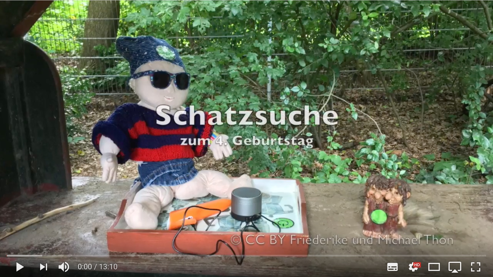

# Schatzsuche

Diese Schatzsuche haben wir auf Kindergeburtstag mit unserem vierjährigen Sohn und einigen Freunden durchgeführt. Sie wird mit einem Tiptoi-Stift gespielt. Man begegnet einigen Figuren und muss Aufgaben lösen. Es ist sozusagen ein einfaches "Point-and-Tip Adventure" :-) Die Schatzsuche ist recht aufwendig und hat ca. 45 Minuten gedauert. Die Kinder (ca. 4 Jahre alt) haben dennoch sehr gut mitgemacht.

Hier ein Video,	das den	Ablauf der Schatzsuche demonstriert.

# Wie wurde die Schatzsuche gemacht

Zum erstellen der Schatzsuche wurde `tttool` benötigt. Das "Tiptoi-Tool" ist das zentrale Werkzeug, um eigene Tiptoi Basteleien zu erstellen. Auf der Webseite findet man auch alle benötigten Anleitungen, Links zu weiteren Projekten, und eine E-Mail Liste für Tiptoi Bastler.

Außerdem muss man "OID-Codes" (werden von `tttool` erstellt) über alle Zeichnungen / Objekte legen und ausdrucken. Das habe ich mit Gimp gemacht. Audio wurde mit Audacity bearbeitet.

